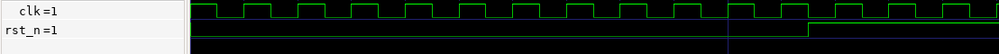
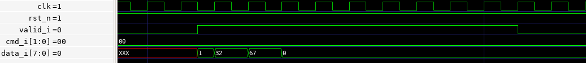
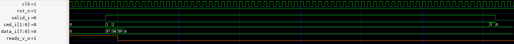
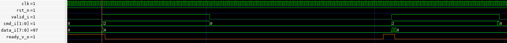

<!---

This file is used to generate your project datasheet. Please fill in the information below and delete any unused
sections.

You can also include images in this folder and reference them in the markdown. Each image must be less than
512 kb in size, and the combined size of all images must be less than 1 MB.
-->
# Blake2s

This is a hashing accelerator for the Blake2 cryptographic hash function (RFC 7693).

This is a fully featured Blake2s implementation supporting both block streaming and using a secret key.

## Background 

blake2s short presentation 

what is the configuration 

## Usage

The typical sequence to offload the hashing operation to the accelerator would go as follows:
1. Reset the accelerator (necessary on init)
2. Configure the hash parameters $kk$, $nn$, $ll$ (can be reused once configured)
3. Stream the input data by blocks of 64 bytes
4. Read the hash result

All data exchanges with the accelerator are in little endian, and when sending multiple-byte-long arrays, the lower indexes are sent first.

Notes:
- Empty cycles, as in one or more cycles where `data_v_i` would go low in the middle of the transfer of both the input data and the configuration, are supported.
### Reset

In order to reset this accelerator to its default uninitialized state, deassert the `rst_n` signal for at least 5 clock cycles. During normal operations, `rst_n` should be set to `1`.

During at least 5 cycles:
- `rst_n` is set to `0`

#### Example

Typical reset sequence:



### Sending the Configuration

The configuration packet is 10 bytes long and has the following format:
```
 Byte:   0        1        2        3        4        5        6        7        8        9
         +--------+--------+---------------------------------------------------------------+
         |   kk   |   nn   |                          ll                                   |
         +--------+--------+---------------------------------------------------------------+
```

$kk$ and $nn$ are both 8 bits wide, and $ll$ is 64 bits wide, and all use little endian.

Sending the configuration takes 10 data transfer cycles, during which:
- `valid_i` is set to `1`
- `mode_i[1:0]` is set to `0`, indicating we are sending the configuration packet
- `data_i[7:0]` sends the next byte of the configuration packet

#### Example

In this example we are sending the following configuration:
- $kk = 1$ (1 Byte)
- $nn = 32$ (1 Byte) 
- $ll = 67$ (8 Bytes) 



#### Software

In the firmware, the `send_config` function defined in `data_wr_utils.h` is used to send a configuration to the accelerator.
```C
void send_config(uint8_t kk, uint8_t nn, uint64_t ll, uint dma_chan, pinout_t *p, size_t pl, PIO pio, uint sm);
```
Parameters : 
- `kk` confirguration value, key length
- `nn` configuration value, final hash length in bytes
- `ll` configuration value, raw data length
- `dma_chan` is the DMA channel used to offload copying data between the memory and the RP2040's PIO
- `p` is a pointer to the shared pre-allocated pool of memory we can temporarily use to allocate the necessary `pinout_t`
- `pio` is the base address of the PIO where the data write program is running
- `sm` is the index of the PIO state machine where the data write program is running

### Sending Data

Just like in the original hashing algorithm, the stream of data to be hashed must first be padded with `0x00` to a multiple of 64 bytes, then starting from the lowest indexes first, blocks are sent one by one, one byte at a time.

The sequence to send a block is as follows:
- Wait for ASIC to set `ready_v_o` to `1`

Then, start the 64 data transfer cycles during which:
- `valid_i` is set to `1`
- `mode_i[1:0]` is set to `1` if this is the first data transfer cycle of the first block, `3` if this is the last data transfer cycle of the last block, else it is set to `2`
- `data_i[7:0]` contains the current data byte

The `ready_v_o` signal indicates the accelerator is ready to receive data. In order to improve performance, users can skip waiting for this signal to be re-asserted between each byte transfer and can safely proceed with sending the entire block as soon as the `ready_v_o` signal is observed at `1`.

This optimization has a limitation: since it takes 2 clock cycles for the new value of `ready_v_o` to be written on the output pin, users employing this optimization must guarantee at least a 30ns gap (for 66MHz) between the end of the previous block write and the evaluation of the next `ready_v_o` signal. The current firmware guarantees such a gap.

#### Single Block Example

This is an example of a simple data transfer sequence where the entirety of the data fits within a single block.

Given there is a single block, meaning it is both the first and last block, the `mode_i` control bits are set to `1` on the first cycle and `3` on the last cycle.



#### Multi-Block Example

In this example we are sending two blocks of data.

This example shows the data transfer associated with the configuration waves used as an example above ($kk = 1, nn = 32, ll = 67$).

The first block contains the key of size $kk = 1$ byte, the key's contents are 'a' and padded with `0x00` up to 64 bytes.

After the first block has finished sending, we wait until the accelerator asserts the `ready_v_o` signal before starting the second transfer.

The second block contains the $ll - (kk>0?64:0)$, here 3, bytes of data "abc", again padded with `0x00` until 64 bytes.



#### Software 

In the firmware, for sending data to the accelerator we use the `send_data` function defined in the `data_wr_utils.h` header.
```C
void send_data(uint8_t *data, size_t dl, pinout_t *p, size_t pl, uint dma_chan, PIO pio, uint sm);
```
Parameters : 
- `data` is a pointer to the raw data (not extended to a multiple of 64 bytes) to be hashed
- `dl` is the `data` length in bytes
- `p` is a pointer to the shared pre-allocated pool of memory we can temporarily use to allocate the necessary `pinout_t`
- `dma_chan` is the DMA channel used to offload copying data between the memory and the RP2040's PIO
- `pio` is the base address of the PIO where the data write program is running
- `sm` is the index of the PIO state machine where the data write program is running

### Slow Output Mode

For the `sky130b` shuttle, although the maximum stable GPIO input switching frequency is 66 MHz, due to a weak driver on the output buffer path resulting in much higher slew rate, the current maximum stable supported transitioning frequency is believed to be 33 MHz.

In order to allow more room for experimenting with the limits of the maximum stable output switching rate while supporting a more stable operating mode, the "slow output" mode was added to this design.

Users simply looking to reliably use the accelerator should always have the slow output mode set.

This mode can be enabled by setting `output_mode_i[1:0]` at any time while the accelerator is hashing or receiving data, but for more reliability, we recommend the user simply clamp these pins using the GPIO.

Setting the slow output mode:
- `output_mode_i[1:0]` is set to `3`

### Reading Hash 

After the accelerator finishes hashing the last block if will begin streaming out the final hash result. 
In blake2 the $nn$ configuration parameter specifies how many bytes long the resulting hash should be, this
accelerator follows this convention and will only return $nn$ bytes as a result. 

Since this accelerator was designed to interface with an embedded MCU and not another accelerator or an FPGA, the
accelerator asserts the `hash_v_o` signal ahead of starting to steam out the result. This is done so that we can 
allow the RP2040 PIO to detect the start of the result sequence and initate capturing the data. Because of this, 
this accelerator is tightly co-designed with the PR2040 in mind and cannot be ported to other MCU families, as it is reliant 
on a 15/30ns(if slow mode is set) reaction time, followed by a very timing accurate capture of the GPIO values.
See `firmware/data_rd.pio` for this PIO assembly program. 

If slow output mode is set, see [above](#slow-output-mode) all data steps in the data output sequence take 2 cycles, else, 
each step takes 1 cycle. 

The has read sequence has 2 parts: 

1. `hash_v_o` is set to `1` for 1 step (1/2 cycles) in order to let the PIO initate data capture
2. the hash result is streamed over $nn$ steps :
   - `hash_v_o` is set to `1`
   - `hash_o[7:0]` contains the hash result
  
 #### Hash result in slow output mode

 #### Hash result in fast output mode 


